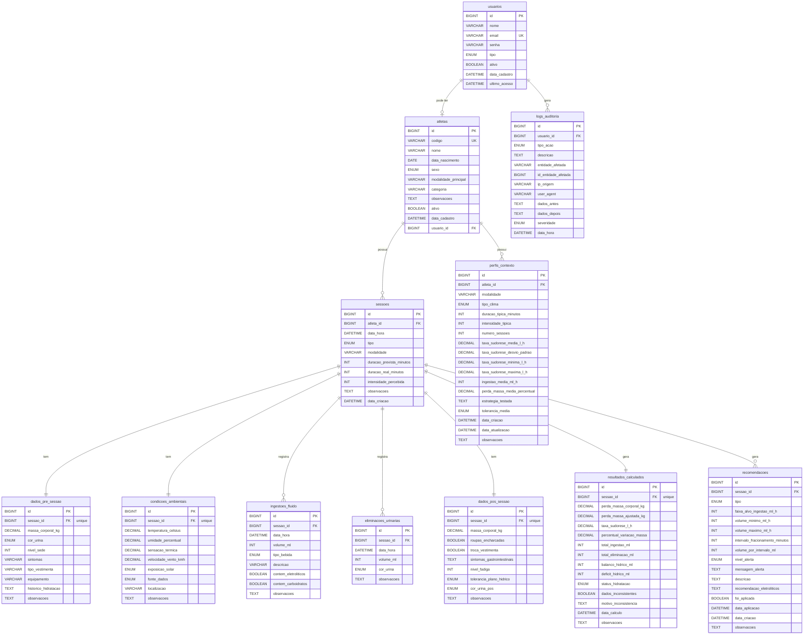

# Diagrama Entidade-Relacionamento (ER) - HidraTrack

## Visão Geral do Banco de Dados

Este documento apresenta o diagrama ER completo do sistema HidraTrack para monitoramento de taxa de sudorese e hidratação de atletas.

---

## Diagrama ER



---

## Descrição das Entidades

### 1. **usuarios**
**Propósito**: Armazena os usuários do sistema com diferentes níveis de acesso.

**Tipos de Usuário**:
- `ATLETA`: Atleta com acesso próprio aos seus dados
- `NUTRICIONISTA`: Profissional responsável por orientação nutricional
- `TREINADOR`: Treinador esportivo
- `MEDICO`: Médico responsável

**Campos Principais**:
- `email`: Único, usado para autenticação
- `senha`: Hash BCrypt para segurança
- `ativo`: Controle de ativação/desativação

---

### 2. **atletas**
**Propósito**: Cadastro dos atletas monitorados no sistema.

**Privacidade**:
- `codigo`: Identificador anônimo para proteger identidade
- Pode estar associado a um usuário ou não (FK opcional)

**Campos Principais**:
- `modalidade_principal`: Esporte praticado
- `categoria`: Nível competitivo
- `data_nascimento`: Para cálculos de idade e perfil

---

### 3. **sessoes**
**Propósito**: Entidade central que representa uma sessão de treino ou competição.

**Relacionamentos**: Hub que conecta todos os dados coletados antes, durante e após a atividade.

**Tipos**:
- `TREINO`: Sessão de treinamento
- `COMPETICAO`: Competição oficial
- `TESTE`: Sessão de teste/avaliação

---

### 4. **dados_pre_sessao**
**Propósito**: Dados coletados ANTES da sessão iniciar.

**Importância**:
- Massa corporal pré-exercício (baseline)
- Estado de hidratação inicial (cor da urina)
- Condições do atleta (sede, sintomas)

**Relação**: 1:1 com sessão

---

### 5. **condicoes_ambientais**
**Propósito**: Condições climáticas durante a sessão.

**Fontes de Dados**:
- `MANUAL`: Inserido pelo usuário
- `API_CLIMA`: Obtido automaticamente via API
- `SENSOR_LOCAL`: Medido no local de treino

**Impacto**: Influencia diretamente na taxa de sudorese.

---

### 6. **ingestoes_fluido**
**Propósito**: Registra cada evento de ingestão de fluidos durante a sessão.

**Relação**: 1:N com sessão (múltiplos eventos)

**Dados Importantes**:
- Volume exato (mL)
- Tipo de bebida
- Presença de eletrólitos/carboidratos

---

### 7. **eliminacoes_urinarias**
**Propósito**: Registra eliminação urinária durante a sessão (quando aplicável).

**Relação**: 1:N com sessão

**Uso**: Ajuste no cálculo da perda hídrica real.

---

### 8. **dados_pos_sessao**
**Propósito**: Dados coletados APÓS o término da sessão.

**Dados Críticos**:
- Massa corporal pós-exercício
- Roupas encharcadas (ajuste de erro)
- Tolerância ao plano de hidratação

**Relação**: 1:1 com sessão

---

### 9. **resultados_calculados**
**Propósito**: Armazena todos os cálculos automáticos realizados.

**Fórmulas Principais**:

#### Taxa de Sudorese (L/h):
```
Taxa = (Massa Pré - Massa Pós + Ingestão - Eliminação) / Duração (h)
```

#### Percentual de Variação de Massa:
```
% = ((Massa Pós - Massa Pré) / Massa Pré) × 100
```

#### Balanço Hídrico:
```
Balanço = Ingestão - (Perda por Suor + Eliminação Urinária)
```

**Status de Hidratação**:
- `BEM_HIDRATADO`: < 1% perda
- `LEVEMENTE_DESIDRATADO`: 1-2%
- `MODERADAMENTE_DESIDRATADO`: 2-3%
- `DESIDRATADO`: 3-5%
- `SEVERAMENTE_DESIDRATADO`: > 5%
- `HIPERIDRATADO`: Ganho de massa
- `INCONSISTENTE`: Dados implausíveis

---

### 10. **recomendacoes**
**Propósito**: Recomendações individualizadas geradas automaticamente.

**Relação**: 1:N com sessão (múltiplas recomendações possíveis)

**Tipos de Recomendação**:
- Hidratação geral
- Ajuste de volume
- Fracionamento de ingestão
- Suplementação de eletrólitos
- Alertas de risco

**Níveis de Alerta**:
- `INFORMATIVO`: Apenas informação
- `ATENCAO`: Requer atenção
- `CUIDADO`: Risco moderado
- `URGENTE`: Risco alto
- `CRITICO`: Intervenção imediata necessária

---

### 11. **perfis_contexto**
**Propósito**: Agrega dados históricos do atleta por contexto similar.

**Agrupamento Por**:
- Modalidade
- Tipo de clima
- Duração
- Intensidade

**Uso**: Aprendizado para sessões futuras e personalização.

**Relação**: 1:N com atleta (vários perfis por atleta)

---

### 12. **logs_auditoria**
**Propósito**: Rastreabilidade completa de ações no sistema.

**LGPD/Compliance**: Essencial para conformidade com privacidade de dados.

**Registra**:
- Quem acessou (usuário)
- O que fez (tipo de ação)
- Quando (timestamp)
- De onde (IP)
- Dados antes/depois (para reversão)

---

## Relacionamentos Principais

### Cardinalidade

| Relacionamento | Cardinalidade | Descrição |
|---------------|---------------|-----------|
| Usuario → Atleta | 1:1 (opcional) | Um usuário pode ser um atleta |
| Atleta → Sessão | 1:N | Um atleta tem múltiplas sessões |
| Sessão → DadosPreSessao | 1:1 | Uma sessão tem dados pré |
| Sessão → CondicaoAmbiental | 1:1 | Uma sessão tem condições ambientais |
| Sessão → IngestaoFluido | 1:N | Múltiplos eventos de ingestão |
| Sessão → EliminacaoUrinaria | 1:N | Múltiplos eventos de eliminação |
| Sessão → DadosPosSessao | 1:1 | Uma sessão tem dados pós |
| Sessão → ResultadoCalculado | 1:1 | Uma sessão gera um resultado |
| Sessão → Recomendacao | 1:N | Múltiplas recomendações |
| Atleta → PerfilContexto | 1:N | Múltiplos perfis por atleta |
| Usuario → LogAuditoria | 1:N | Múltiplos logs por usuário |

---

## Índices Importantes

### Índices de Performance

```sql
-- Buscas frequentes por atleta
INDEX idx_atleta ON sessoes(atleta_id)
INDEX idx_atleta ON perfis_contexto(atleta_id)

-- Buscas por período temporal
INDEX idx_data_hora ON sessoes(data_hora)
INDEX idx_data_hora ON logs_auditoria(data_hora)

-- Filtros por tipo e status
INDEX idx_tipo ON sessoes(tipo)
INDEX idx_status ON resultados_calculados(status_hidratacao)
INDEX idx_tipo_acao ON logs_auditoria(tipo_acao)

-- Buscas de segurança
INDEX idx_email ON usuarios(email)
INDEX idx_codigo ON atletas(codigo)
```

---

## Views Criadas

### vw_sessoes_resumo
Visão consolidada de sessões com resultados principais.

**Uso**: Dashboards e relatórios rápidos.

### vw_estatisticas_atleta
Estatísticas agregadas por atleta.

**Inclui**:
- Total de sessões
- Taxa de sudorese média/desvio/min/max
- Perda de massa média
- Ingestão média

---

## Regras de Integridade

### Constraints Importantes

1. **Validações de Valores**:
   - Massa corporal > 0
   - Intensidade e fadiga entre 1-10
   - Umidade entre 0-100%
   - Volumes de ingestão/eliminação > 0

2. **Unicidade**:
   - Email de usuário
   - Código de atleta
   - Sessão em dados_pre_sessao, dados_pos_sessao, etc.

3. **Cascata de Deleção**:
   - Deletar atleta → deleta sessões
   - Deletar sessão → deleta todos dados relacionados
   - Deletar usuário → deleta logs de auditoria

---

## Considerações de Segurança

### Privacidade (LGPD)

1. **Pseudonimização**: Atletas identificados por código, não nome
2. **Criptografia**: Senhas com BCrypt
3. **Auditoria**: Todo acesso registrado em logs
4. **Controle de Acesso**: Por tipo de usuário (RBAC)

### Backup e Recuperação

- Todas as tabelas usam `InnoDB` (transacional)
- Timestamps de criação e atualização
- Dados antes/depois em logs para rollback

---

## Próximos Passos

### Fase de Implementação

1. ✅ Criar entidades JPA
2. ✅ Criar repositories
3. ✅ Configurar conexão BD
4. ✅ Script SQL de criação
5. ✅ Diagrama ER

### Próximas Fases

6. Implementar Services (lógica de negócio)
7. Implementar Controllers (API REST)
8. Adicionar Spring Security
9. Criar DTOs para transferência de dados
10. Testes unitários e integração

---

## Informações Técnicas

- **SGBD**: MySQL 8.0+
- **Charset**: UTF8MB4 (Unicode completo)
- **Engine**: InnoDB (transacional, FK, índices)
- **ORM**: Hibernate via Spring Data JPA
- **Estratégia DDL**: `update` (desenvolvimento), `validate` (produção)

---

**Versão**: 1.0  
**Data**: 2026-04-28  
**Projeto**: HidraTrack - São Camilo Nutri-Esportiva
